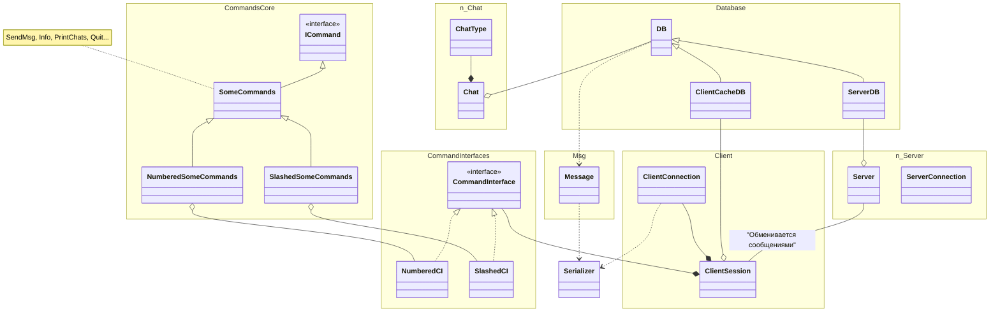

# Диаграмма классов

## Цель

Улучшить понимание структуры системы 

## Основные классы
- **DB (ServerDB + ClientCacheDB)**

- CommandInterface
    - NumberedCI
    - SlashedCI
- CommandFactory

<!-- - Client -->
- ClientSession
    - ClientConnection
- Chat
    - ChatType
    - <<"enumeration>> Type
- User
- Message
- Server
    - ServerSession
- ICommand
    - InfoCommand
    - SendMsgCommand
        - NumberedSendMsgCommand
        - SlashedSendMsgCommand
    - PrintChatsListCommand
    - OpenChatCommand
    - ExitAccountCommand
    - QuitAppCommand
- CommandParser

<!-- - UI -- надстройка над CI? -->

- Serializer

## Схема




<!-- 
# ...

```mermaid
classDiagram
    classA <|-- classB
    classC *-- classD
    classE o-- classF
    classG <-- classH
    classI -- classJ
    classK <.. classL
    classM <|.. classN
    classO .. classP
``` -->